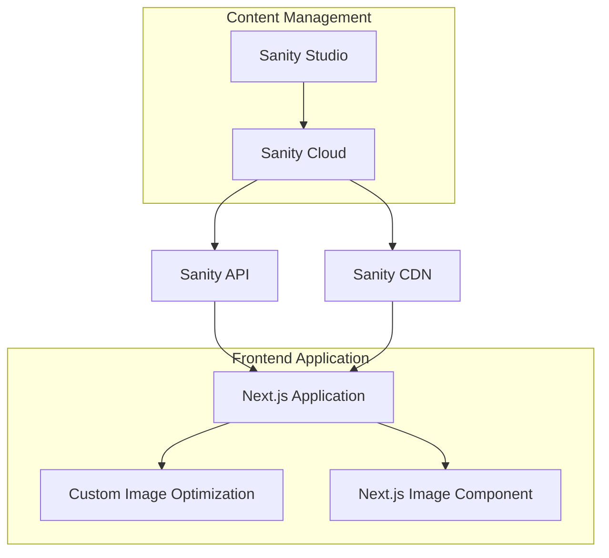

# Design Document

## Overview

本设计文档描述了将 Sanity CMS 集成到现有 Next.js 项目中的技术架构，重点实现图片上传、管理和优化功能。系统采用 Headless CMS 架构，Sanity 作为内容管理后端，Next.js 作为前端展示层，通过 API 进行数据交互。

## Architecture

### System Architecture



### Data Flow

1. **Upload Flow**: 管理员通过 Sanity Studio 上传图片 → Sanity Cloud 存储 → 生成 CDN URL
2. **Display Flow**: Next.js 应用通过 Sanity API 获取图片数据 → 自定义优化处理 → Next.js Image 组件渲染
3. **Optimization Flow**: 原始图片 → Sanity CDN 基础处理 → Next.js 自定义优化 → 缓存优化结果

## Components and Interfaces

### Sanity Configuration

#### Schema Definition
```javascript
// schemas/image.js
export default {
  name: 'imageAsset',
  title: 'Image Asset',
  type: 'document',
  fields: [
    {
      name: 'title',
      title: 'Title',
      type: 'string',
      validation: Rule => Rule.required()
    },
    {
      name: 'image',
      title: 'Image',
      type: 'image',
      options: {
        hotspot: true
      },
      fields: [
        {
          name: 'alt',
          title: 'Alt Text',
          type: 'string',
          validation: Rule => Rule.required()
        }
      ]
    },
    {
      name: 'category',
      title: 'Category',
      type: 'string',
      options: {
        list: [
          {title: 'Hero Images', value: 'hero'},
          {title: 'Gallery', value: 'gallery'},
          {title: 'Thumbnails', value: 'thumbnail'}
        ]
      }
    }
  ]
}
```

#### Sanity Client Configuration
```javascript
// lib/sanity.js
import { createClient } from '@sanity/client'
import imageUrlBuilder from '@sanity/image-url'

export const client = createClient({
  projectId: process.env.NEXT_PUBLIC_SANITY_PROJECT_ID,
  dataset: process.env.NEXT_PUBLIC_SANITY_DATASET,
  useCdn: true,
  apiVersion: '2024-01-01',
  token: process.env.SANITY_API_TOKEN
})

const builder = imageUrlBuilder(client)
export const urlFor = (source) => builder.image(source)
```

### Next.js Integration

#### Image Service
```javascript
// services/imageService.js
export class ImageService {
  static async getImages(category = null) {
    const query = category 
      ? `*[_type == "imageAsset" && category == $category]`
      : `*[_type == "imageAsset"]`
    
    return await client.fetch(query, { category })
  }
  
  static async getImageById(id) {
    return await client.fetch(`*[_type == "imageAsset" && _id == $id][0]`, { id })
  }
  
  static optimizeImageUrl(imageRef, options = {}) {
    const { width, height, quality = 80, format = 'webp' } = options
    
    let url = urlFor(imageRef)
    
    if (width) url = url.width(width)
    if (height) url = url.height(height)
    
    return url.quality(quality).format(format).url()
  }
}
```

#### Custom Image Optimization Component
```javascript
// components/OptimizedImage.jsx
import Image from 'next/image'
import { useState } from 'react'
import { ImageService } from '../services/imageService'

export default function OptimizedImage({ 
  imageRef, 
  alt, 
  width, 
  height, 
  className,
  priority = false 
}) {
  const [isLoading, setIsLoading] = useState(true)
  const [error, setError] = useState(false)
  
  const handleLoad = () => setIsLoading(false)
  const handleError = () => {
    setError(true)
    setIsLoading(false)
  }
  
  if (error) {
    return (
      <div className={`placeholder-image ${className}`}>
        <span>Image not available</span>
      </div>
    )
  }
  
  const optimizedUrl = ImageService.optimizeImageUrl(imageRef, {
    width,
    height,
    quality: 85,
    format: 'webp'
  })
  
  return (
    <div className={`image-container ${className}`}>
      {isLoading && <div className="image-skeleton" />}
      <Image
        src={optimizedUrl}
        alt={alt}
        width={width}
        height={height}
        priority={priority}
        onLoad={handleLoad}
        onError={handleError}
        className={isLoading ? 'loading' : 'loaded'}
      />
    </div>
  )
}
```

### PNG Optimization Module

#### Custom PNG Processor
```javascript
// lib/pngOptimizer.js
export class PNGOptimizer {
  static async optimizePNG(imageUrl, options = {}) {
    const { 
      compressionLevel = 6,
      stripMetadata = true,
      convertToWebP = true 
    } = options
    
    try {
      // 实现自定义 PNG 优化逻辑
      // 这里可以集成 sharp、imagemin 等库
      const optimizedUrl = await this.processImage(imageUrl, {
        compressionLevel,
        stripMetadata,
        convertToWebP
      })
      
      return optimizedUrl
    } catch (error) {
      console.error('PNG optimization failed:', error)
      return imageUrl // 降级返回原始 URL
    }
  }
  
  static async processImage(url, options) {
    // 实现具体的图片处理逻辑
    // 可以调用 API 路由进行服务端处理
    const response = await fetch('/api/optimize-image', {
      method: 'POST',
      headers: { 'Content-Type': 'application/json' },
      body: JSON.stringify({ url, options })
    })
    
    const result = await response.json()
    return result.optimizedUrl
  }
}
```

## Data Models

### Sanity Schema Structure

#### Image Asset Document
```typescript
interface ImageAsset {
  _id: string
  _type: 'imageAsset'
  title: string
  image: {
    asset: {
      _ref: string
      _type: 'reference'
    }
    hotspot?: {
      x: number
      y: number
      height: number
      width: number
    }
    crop?: {
      top: number
      bottom: number
      left: number
      right: number
    }
    alt: string
  }
  category: 'hero' | 'gallery' | 'thumbnail'
  _createdAt: string
  _updatedAt: string
}
```

#### API Response Types
```typescript
interface ImageResponse {
  images: ImageAsset[]
  total: number
  hasMore: boolean
}

interface OptimizedImageData {
  originalUrl: string
  optimizedUrl: string
  webpUrl?: string
  avifUrl?: string
  metadata: {
    width: number
    height: number
    format: string
    size: number
  }
}
```

## Error Handling

### API Error Handling
```javascript
// lib/errorHandler.js
export class APIErrorHandler {
  static handleSanityError(error) {
    console.error('Sanity API Error:', error)
    
    if (error.statusCode === 401) {
      throw new Error('Unauthorized access to Sanity')
    }
    
    if (error.statusCode === 429) {
      throw new Error('Rate limit exceeded')
    }
    
    throw new Error('Failed to fetch data from Sanity')
  }
  
  static handleImageOptimizationError(error) {
    console.error('Image optimization error:', error)
    return {
      success: false,
      fallbackUrl: '/images/placeholder.jpg',
      error: error.message
    }
  }
}
```

### Frontend Error Boundaries
```javascript
// components/ImageErrorBoundary.jsx
import { Component } from 'react'

export class ImageErrorBoundary extends Component {
  constructor(props) {
    super(props)
    this.state = { hasError: false }
  }
  
  static getDerivedStateFromError(error) {
    return { hasError: true }
  }
  
  componentDidCatch(error, errorInfo) {
    console.error('Image component error:', error, errorInfo)
  }
  
  render() {
    if (this.state.hasError) {
      return (
        <div className="image-error-fallback">
          
        </div>
      )
    }
    
    return this.props.children
  }
}
```

## Testing Strategy

### Unit Tests
- Sanity client configuration and connection
- Image service methods (getImages, optimizeImageUrl)
- PNG optimization functions
- Error handling utilities

### Integration Tests
- Sanity API data fetching
- Image optimization pipeline
- Next.js Image component integration
- Error boundary behavior

### Performance Tests
- Image loading performance
- CDN response times
- Optimization algorithm efficiency
- Memory usage during image processing

### Test Structure
```javascript
// __tests__/imageService.test.js
describe('ImageService', () => {
  test('should fetch images from Sanity', async () => {
    // Test implementation
  })
  
  test('should optimize image URLs correctly', () => {
    // Test implementation
  })
  
  test('should handle API errors gracefully', async () => {
    // Test implementation
  })
})
```

## Performance Considerations

### Caching Strategy
- **Browser Cache**: 利用 Next.js Image 组件的内置缓存
- **CDN Cache**: 配置 Sanity CDN 缓存策略
- **API Cache**: 实现 SWR 或 React Query 进行数据缓存

### Image Optimization Pipeline
1. **Sanity CDN**: 基础尺寸调整和格式转换
2. **Custom Processing**: PNG 特定优化算法
3. **Next.js Image**: 懒加载和响应式处理
4. **Browser Cache**: 客户端缓存优化结果

### Loading Performance
- 实现图片懒加载
- 使用占位符和骨架屏
- 优先加载关键图片
- 预加载下一页图片

## Security Considerations

### API Security
- 使用只读 token 进行前端 API 访问
- 限制 CORS 域名
- 实现 API 速率限制

### Image Security
- 验证图片文件类型和大小
- 防止恶意图片上传
- 实现图片内容扫描（如需要）

### Environment Variables
```env
NEXT_PUBLIC_SANITY_PROJECT_ID=your_project_id
NEXT_PUBLIC_SANITY_DATASET=production
SANITY_API_TOKEN=your_api_token
SANITY_STUDIO_URL=https://your-project.sanity.studio
```